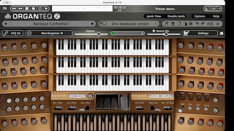

# talon-organteq
[Talon](https://talonvoice.com/) voice commands for hands-free control of pipe organ registration (stops, couplers, etc) in Modartt's [Organteq 2](https://www.modartt.com/organteq_overview) software instrument, by communicating with its built-in JSON-RPC server at `http://127.0.0.1:8081/jsonrpc`.

This repo doesn't aspire to provide full control of Organteq. Rather the focus is on just a small subset of commands that are particularly useful to be able to modify hands-free during play.

Organteq is a trademark of Modartt. This project is not affiliated with or endorsed by Modartt.

## Features
- Manipulate stops by number, tonal family, and footage (e.g., "8-foot reeds")
- Clear all stops on a manual
- Memorize stop configurations per manual
- Recall the last-used stops
- Send custom MIDI messages

## Getting started
### The cocktail party problem
First you should be aware of some inherent difficulties in getting good results from any setup like this in which you're trying to issue _voice commands_ while playing a potentially loud musical instrument. If you're using headphones, then you may be OK. But if you aren't, then you have two problems to solve in your setup:
1. How to avoid false positives from the speech recognition engine (i.e. sounds from the organ being spuriously picked up as voice commands)
2. How to ensure your spoken commands are clearly audible over the sound from Organteq

To get around these things, your microphone and its placement will matter a lot. I get reasonably good results with my Shure SM7db dynamic mic with cardioid pickup pattern, directed _away_ from my speakers and placed very close to my mouth while I'm playing, within about 6 inches ideally. Alternatively, a good directional headset mic would presumably be much better at isolating your voice from environmental noise (and music), such as the DPA d:fine 4188 or 4288, but I have not tried that myself.

Your choice of speech recognition engine within Talon also matters. For example, the Conformer D2 engine (unfortunately available in Talon beta only) may do better at reducing false positives.

### Prerequisites
- Install [Talon Voice](https://talonvoice.com/) and set up a speech engine
- Install Modartt's [Organteq 2](https://www.modartt.com/organteq_overview)
- You must have `curl` available in your system PATH

### Installation
Once the prerequisites above are met, you can simply do this on Mac or Linux:
```
git clone https://github.com/myersm0/talon-organteq ~/.talon/user/
```

## Usage
First you will have to launch Organteq with JSON-RPC server enabled. On a Mac this can be done from the command line like this:
```
/Applications/Organteq\ 2/Organteq\ 2.app/Contents/MacOS/Organteq\ 2 --serve
```

### Stop control
The general syntax for controlling stops follows the pattern:
```
[action] [manual] <stop-identifier(s)>
```

Where:
- **action** (optional): The operation to perform. Can be `toggle` (default if omitted), `push`/`disengage`, or `pull`/`engage`
- **manual** (optional): The target manual (`pedal`, `choir`, `great`, or `swell`). Can be omitted if you've previously set a manual context with `use [manual]`
- **stop-identifiers** (required): Specify which stops to control. Can be either:
  - Stop numbers (e.g., `one three five`)
  - A tonal family (e.g., `reeds`, `principals`)
  - A footage combined with a tonal family (e.g., `8-foot reeds`)

#### Stop control by number
```
great one three twelve       # toggle stops 1, 3, and 12 on the Great
swell two                    # toggle stop 2 on the Swell
pedal four seven             # toggle Pedal stops 4 and 7
```

Engage stops (pull them out):
```
pull great one three twelve       # engage stops 1, 3, and 12 on the Great
```

Disengage stops (push them in):
```
push great one three twelve       # disengage stops 1, 3, and 12 on the Great
```

Set a current manual to avoid repeating the manual name:
```
use great                    # set Great as current manual
one three twelve             # toggle stops 1, 3, 12 on Great
pull two four                # engage stops 2, 4 on Great
push five                    # disengage stop 5 on Great
```

Clearing all stops follows a slightly different pattern:
```
cancel great                  # turn off all stops on the Great
cancel swell                  # turn off all stops on the Swell
cancel choir                  # turn off all stops on the Choir
cancel pedal                  # turn off all stops on the Pedal
general cancel                # turn off all stops on all keyboards
```

#### Stop control by tonal family
You can control groups of stops by their tonal family (principals, flutes, strings, reeds, mutations, mixtures) and optionally filter by footage:

```
use great                    # set context to Great manual
toggle reeds                 # toggle all reed stops on Great
pull 4-foot reeds            # engage all 4-foot reed stops
pull 8-foot principals       # engage all 8-foot principal stops
push flutes                  # disengage all flute stops
```

Available families: `principals`, `flutes`, `strings`, `reeds`, `mutations`, `mixtures`.

### Memory features
Each manual maintains separate memory for "last stops" and "remembered stops":
```
use great
remember one seven nine      # remember stops 1, 7, 9 for Great
toggle                       # toggle the remembered stops
push                         # engage the remembered stops
toggle last                  # toggle whatever stops were most recently used
```

### Demo video
[](https://www.youtube.com/watch?v=FctiTs6D2tM](https://vimeo.com/1138588497 "talon-organteq usage demo")

